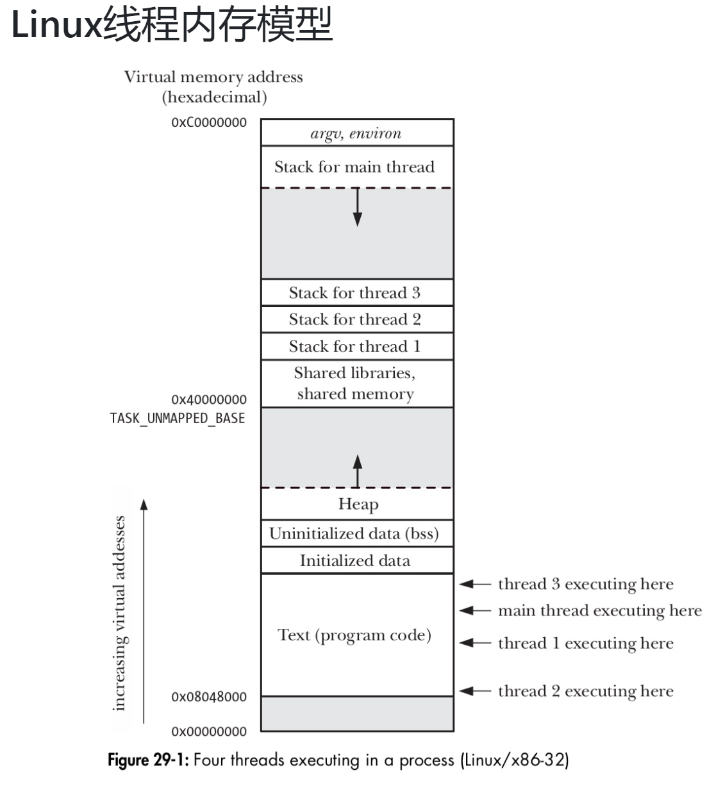

## linux线程内存模型



## practice

### 辅助类
```cpp
class Timer {
private:
    clock_t start_;
    string msg_;
public:
    Timer(const char *msg) : msg_(msg) {
        start_ = clock();
    }

    Timer() : msg_() {
        start_ = clock();
    }

    ~Timer() {
        float t = ((float)(clock() - start_)) / CLOCKS_PER_SEC;
        if(msg_ != "")
            cout << msg_ << " time used: " << t << " seconds" << endl;
        else 
            cout << "time used: " << t << " seconds" << endl;
    }
};

class Seperator{
private:
    string str;
public:
    Seperator(const char *msg) : str(msg) {
        cout << "==========" << str << "==========" << endl;
    }
    
    ~Seperator() {
        cout << string(str.length() + 20, '=') << endl;
    }
};
```

### 0、打印你的计算机std::thread::hardware_concurrency
```cpp
void practice0() {
    Seperator seperator(string("practice0"));
    cout << "hardware_concurrency: " << thread::hardware_concurrency << endl;
}
```


### 1、创建一个线程，并传递给它一个单词列表，每秒打印一个单词。
```cpp
void practice1() {
    Seperator seperator("practice1");
    vector<string>words({"hello", "this", "is", "kevin"});
    thread t([](vector<string> words){
        for(auto & str : words) {
            this_thread::sleep_for(chrono::seconds(1));
            cout << str << " ";
        }
        cout << endl;
    }, words);
    t.join();
}
```


### 2、创建一个线程，将传递进来的单词列表的单词首字母改为大写。
```cpp
void practice2() {
    Seperator seperator("practice2");
    vector<string>words({"hello", "this", "is", "kevin"});
    thread t([](vector<string> &words){
        for(auto &str : words) {
            str[0] &= 0x5f;
        }
    }, ref(words)); // 使用ref传递words引用
    t.join();
    //cout << partial_sum(words.begin(), words.end(), "") << endl;
    for(auto &str : words) {
        cout << str << " ";
    }
    cout << endl;
}
```


### 3、创建3-5个线程，每个线程循环5-10次，每次循环输出一个随机数，每次间隔0-1s
```cpp
void practice3() {
    Seperator seperator("practice3");
    default_random_engine generator(chrono::system_clock::now().time_since_epoch().count());
    uniform_int_distribution<int> distribution(0, 100);

    int threadNum = distribution(generator) % 3 + 3;
    cout << "Thread nums: " << threadNum << endl;
    vector<thread> threads;
    // 存在问题
    // fill_n(back_inserter(threads), threadNum, thread([&](){
    //     int loopNum = distribution(generator) % 5 + 6;
    //     cout << "Thread " << this_thread::get_id() << "#: loopNums->" << loopNum << endl;
    //     while(loopNum--) {
    //         this_thread::sleep_for(chrono::milliseconds(distribution(generator) * 10));
    //         cout << "Thread " << this_thread::get_id() << "#:" << distribution(generator) << endl;
    //     }
    // }));

    for(int i = 0; i < threadNum; i++) {
        threads.push_back(thread([&](){
            int loopNum = distribution(generator) % 5 + 6;
            cout << "Thread " << this_thread::get_id() << "#: loopNums->" << loopNum << endl;
            while(loopNum--) {
                this_thread::sleep_for(chrono::milliseconds(distribution(generator) * 10));
                cout << "Thread " << this_thread::get_id() << "#:" << distribution(generator) << endl;
            }
        }));
    }
    for_each(threads.begin(), threads.end(), mem_fn(&thread::join));
}
```


### 4、生成十万个随机数，使用5个线程计算和，每个线程计算两万个数据的和(多线程共享变量要加锁)
```cpp
void practice4() {
    Seperator seperator("practice4");
    Timer timer("practice4");
    default_random_engine generator(chrono::system_clock::now().time_since_epoch().count());
    uniform_int_distribution<int> distribution(0, 1e2);

    const unsigned int randomNum = 1e5;
    const unsigned int threadNum = 5;
    const unsigned int blockSize = randomNum / threadNum;

    { // solution1
        Timer sln1_timer("solution1");
        vector<long long> nums;
        vector<long long> result(threadNum);
        vector<thread> threads(threadNum);
        //生成十万个0-100的随机数
        generate_n(back_inserter(nums), randomNum, [&](){return distribution(generator);});
        //生成五个线程计算和
        vector<long long>::iterator block_start = nums.begin();
        for(int i = 0; i < threadNum; i++) {
            vector<long long>::iterator block_end = block_start;
            advance(block_end, blockSize);
            threads[i] = thread([](vector<long long>::iterator start, vector<long long>::iterator last, long long &res){
                res = accumulate(start, last, res);
            }, block_start, block_end, ref(result[i])); 
            block_start = block_end;
        }
        for_each(threads.begin(), threads.end(), mem_fn(&thread::join));   
        cout << "Size of nums: " << nums.size() << endl;
        cout << "Sum of 1e5 numbers is(thread): " << accumulate(result.begin(), result.end(), 0) << endl;
        cout << "Sum of 1e5 numbers is(accumulate): " << accumulate(nums.begin(), nums.end(), 0) << endl;
    }

    cout << endl;

    { // solution2
        Timer sln1_timer("solution2");
        vector<long long> nums;
        long long result;
        vector<thread> threads(threadNum);
        //生成十万个0-100的随机数
        generate_n(back_inserter(nums), randomNum, [&](){return distribution(generator);});
        //生成五个线程计算和
        for(int i = 0; i < threadNum; i++) {
            threads[i] = thread([&nums, i](long long &res){
                vector<long long>::iterator block_start = nums.begin() + 2e4 * i;
                vector<long long>::iterator block_last = nums.begin() + 2e4 * (i + 1);
                res += accumulate(block_start, block_last, res);
            }, ref(result));
        }
        for_each(threads.begin(), threads.end(), mem_fn(&thread::join));   
        cout << "Size of nums: " << nums.size() << endl;
        cout << "Sum of 1e5 numbers is(thread): " << result << endl;
        cout << "Sum of 1e5 numbers is(accumulate): " << accumulate(nums.begin(), nums.end(), 0) << endl;
    }

    cout << endl;
}
```


### 5、初始value = 0, 生成十个线程，五个线程执行value += 1，五个线程执行value -= 1, 每个线程执行一百万次，如何保证value得到正确的结果
```cpp
void practice5() {
    Seperator sep("practice5");

    { // error
        int value = 0;
        vector<thread> threads;
        for (int i = 0; i < 10; ++i) {
            if (i < 5) {
                threads.emplace_back([&value] { 
                    for (int i = 0; i < 1e6; ++i)
                        value += 1; 
                });
            } else {
                threads.emplace_back([&value] {
                    for (int i = 0; i < 1e6; ++i)
                        value -= 1;
                });
            }
        }
        for_each(threads.begin(), threads.end(), mem_fn(&thread::join));
        cout << "value = " << value << endl;
    }

    { // correct
        int value = 0;
        vector<thread> threads;
        mutex m;
        for (int i = 0; i < 10; ++i) {
            if (i < 5) {
                threads.emplace_back([&value, &m] { 
                    for (int i = 0; i < 1e6; ++i) {
                        lock_guard<mutex> guard(m);
                        value += 1;
                    }
                });
            } else {
                threads.emplace_back([&value, &m] {
                    for (int i = 0; i < 1e6; ++i) {
                        lock_guard<mutex> guard(m);
                        value -= 1;
                    }
                });
            }
        }
        for_each(threads.begin(), threads.end(), mem_fn(&thread::join));
        cout << "value = " << value << endl;
    }

}

```