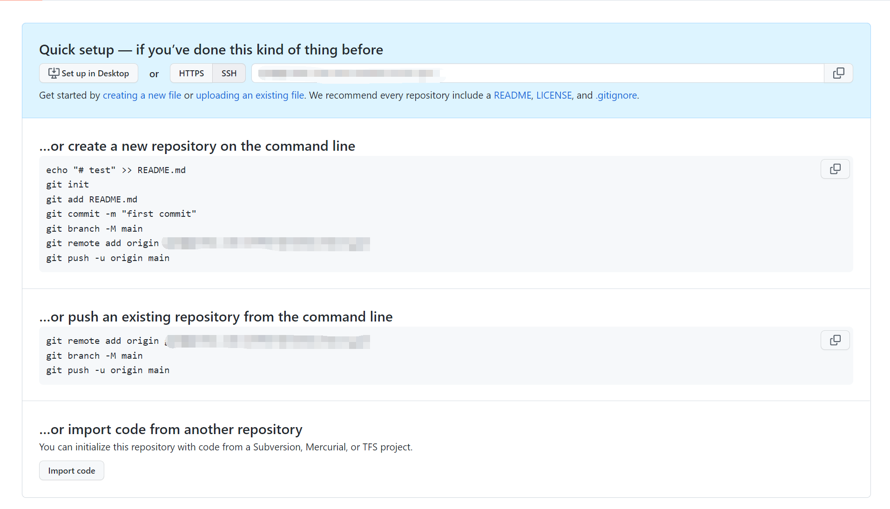

# Git笔记
## 说明
`1、以下举例所用的仓库地址均为：git@github.com:yourname/repo.git`
`2、以下举例所用的仓库地址均为：github_repo`


# 新建仓库
从github中新创建仓库后可以看到下图


- 本地没有代码从0开始
```bash
echo "# test" >> README.md
git init
git add README.md
git commit -m "first commit"
git branch -M main # 修改master分支名字为main
git remote add origin git@github.com:yourname/repo.git
git push -u origin main
```

- 本地已有代码
```bash
git remote add origin git@github.com:yourname/repo.git
git branch -M main # 可以跳过

git push -u origin main
# or
git push -u origin master # 默认存在master分支
```

# git remote
## 列出远程仓库
```bash
git remote
git remote -v # 列出详细信息
```

## 添加/删除远程仓库地址
```bash
git remote add name git@github.com:yourname/repo.git
git remote remove name
```

## 修改仓库名字
```bash
git remote rename oldname newname
```