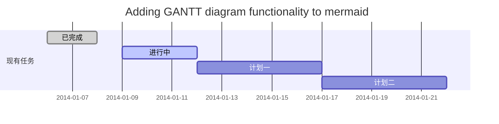
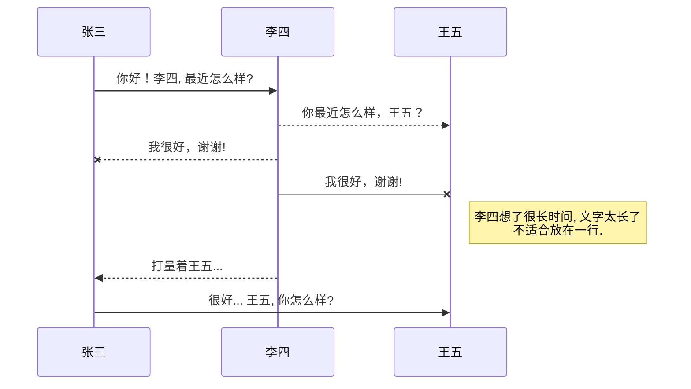
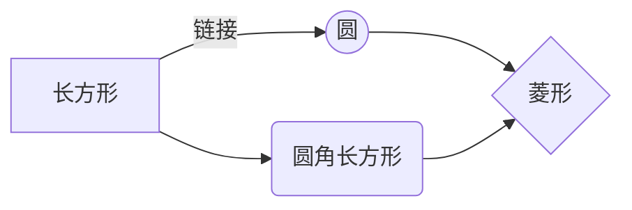

@[TOC](Java核心技术 卷一 学习笔记)
# 写在前面
本人有一些c与c++的基础，阅读此书的同时记录一些学习的笔记与心得，在此与各位分享，其中有些是本人的一些理解，错误之处还请不吝赐教。同时一些本人认为没必要的将只会用黑体字标出，表示有此物存在，若有必要后面会加以补充。
# 第一章 java程序设计概念

Java是一门面向对象语言(Sun是其原先的开发公司)；**java中的int永远为32位**；Java是解释型的(但其代码运行速度与c++相差无几？？)；

# 第二章 Java程序设计环境
缩写|全拼
-|-
JDK|Java Development Kit
JRE|Java Runtime Enviroment
SE|Standard Edition(这是平时主要用的)
EE|Enterprise Edition
SDK|Software Development Kit

**Java环境配置**

**命令行工具**
命令|说明
-|-
javac | 编译java源文件
java | 运行Java程序
例子：
	 javac Welcome.java
	 java Welcome
**运行javac命令后会生成相应的.class文件 运行java命令的时候不要带上后缀**

**构建并运行applet**

# 第三章 Java的基本程序设计结构
## 一个简单的Java应用程序

```java
//注释1
/*注释2*/
/**此种注释方法可用来自动生成文档(不是很清楚这个方法的具体用处)*/
public class FirstSample {
	public static void main(String[] args) {
		System.out.println("Hello World!");//println会自动在结尾加上换行符
		//System.out.print("Hello World!");//结尾没有换行符
	}
}
```
说明:Java 程序的Hello world
编译并运行：
*javac FirstSample.java*
*java FirstSample*

**重点：**
- **Java应用程序的全部内容都必须放置在类中**
- **源代码的文件名必须与公共类的名字相同，且以.java作为扩展名**(上述代码的文件名应保存为FirstSample.java)
- **根据java语言规范，main方法必须声明为public**
- **每个java应用程序都必须有一个main方法**


Java区分大小写，与c/c++类似:在每一句的后面都要加上';' ；;标准的命名规范:骆驼命名法,既每个单词首字母大写；

## 数据类型
类型 | 存储需求
-|-
int|4字节
short|2字节
long|8字节
byte|1字节
float|4字节
double|8字节
char|1字节？
boolean|1字节？**整型值和布尔值之间不能相互转换**
(取值范围与c/c++类似，转义字符'\n','\t'等与c/c++类似)
长整数带后缀‘L’如(40000000000000L)；十六进制0x前缀；八进制前缀0；二进制前缀0b；
**术语解释**
- 码点：与一个编码表中某个字符对应的代码值(如:ASCII中‘a’为97)
- 代码单元：在基本的多语言级别中，每个字符用16位表示，通常被称为代码单元
(不建议在程序中使用char类型，除非确实有需要，最好将字符串作为抽象数据类型处理[太过于底层])
如果想要知道哪些Unicode字符属于Java中的“字母”，可以使用Character类的isJavaIdentifierStart和isJavaIdentitierPart方法检查

## 变量
**变量初始化：type enlement;(int i);**
Java中可以将代码放在任何地方(尽量的靠近变量第一次使用的地方);在Java中不区分变量的声明与定义
**常量 final element;(final double PI = 3.1415953)**
类常量：希望某个常量可以在类的多个方法中使用
public static final double PI = 3.1415953;
## 运算符
当参与/运算的两个数都是int时表示整数除法，否则表示浮点除法(c/c++，其余% 等都类似)
**使用strictfp关键字标记的方法必须使用严格的浮点计算来生成可再生的结果**

### 数学函数与常量
- Math.sqrt()
- Math.pow()
- Math.sin()
- Math.cos()
- Math.exp()
- Math.round() 四舍五入，返回的结果方法为long型
- Math.PI
- Math.E 常量e

```java
import static java.lang.Math.*
//导入Math下的数学函数,之后的使用过程中不必再添加Math前缀
```
**运算符**
运算符|功能
-|-
+=|
-=|
......|
%=|
<<=|
>>>=|
++|
--|
?:|
& \| ^ ~
&& \|\||
<<  >>|
\>>>|用0填充高位，不存在<<<运算符

## 字符串

```java
String e = "Hello";
```
**String类方法**
方法|功能
-|-
substring(a,b)|取[a,b]这一子串
join("/","s","M","XL")|拼接后的字符串为“s/M/XL”
a.equals(t)|判断a字符串与字符串t是否相等(不使用==)
equalsIgnoreCase(t)|与t比较大小并不区分大小写
charAt(n)|返回位置n的代码单元，类似于python的chr()
codePointAt(n)|返回第n个码点
offsetByCodePoints(0,n)|返回第n个码点
length()|返回字符串长度
yourString.codePointCount(0,yourString.length())|返回码点数量
toArray()|将一个字符串转换为码点数组
String(codePoints,0,codePoints.length)|与toArray相反
[String类的在线doc](https://docs.oracle.com/javase/9/docs/api/java/lang/String.html)

### 构建字符串
将多个字符串构建成一个字符串(字符串构建器SreingBuilder)
```java
StringBuilder builder = new StringBuiler();
builder.append(string1);
builder.append(string2);
......
builder.append(stringn);
String completedString = builder.toString();
```
**StringBuilder方法**|**功能**
-|-
Stringbuilder()|构造空的字符串构建器
length()|返回构建器或缓冲器中的代码单元数量
append()|追加字符串并返回this
toString()|将构建器中的内容转换为字符串
insert(int offset,String str)|在offset位置插入字符串并返回this
delete(int startIndex,int endIndex)|删除从startIndex到endIndex的代码单元并返回this
[StringBuilder在线doc](https://docs.oracle.com/javase/9/docs/api/java/lang/StringBuilder.html)

## 输入输出
### 输入输出方法
**输出:** *System.out.println()*
**输入：** *需要包含java.util包*

```java
//首先构造一个Scanner对象，并与“标准输入流”System.in关联
//scanner类定义在java.util中。当使用的类不是在基本的java.lang包中时，需要使用import指示字将相应的包加载进来。
import java.util.*
Scanner in = new Scanner(System.in);
in.nextLine();//输入一行
in.next();//读取一个单词
in.nextInt();//读取一个整数
```
**Scanner类方法**
Scanner方法|功能
-|-
nextDouble()|
hasNext()|检测输入中是否还有其它单词
hasNextInt()|检测输入中是否还有整数
hasNextDouble()|
[Scanner在线doc](https://docs.oracle.com/javase/9/docs/api/java/util/Scanner.html)

**java.lang.System   java.io.Console**
### 格式化输出

```java
System.out.printf("%8.2f",x);//用法与c的printf类似
System.out.printf("Hello %s",name);
System.out.printf("%tc",new Date());//打印当前日期和时间
```
### 文件输入与输出
>如果想要对文件进行读取，就需要用一个File对象构造一个Scanner对象，如下所示
>要想写入文件，就需要构造PrintWriter对象，在构造器中，只需提供文件名
```java
//对文件进行读取(所谓的File对象就是Path.get的返回值？？)
Scanner in = new Scanner(Paths.get("myfile.txt"),"UTF-8");
//Scanner in = new Scanner(Paths.get("C:\\myfile.txt"),"UTF-8");
//写入文件
PrintWriter out = PrintWriter("myfile.txt","UTF-8");

//可以构造一个带有字符串参数的Scanner，但这个Scanner将这个字符串解释为数据，而不是文件名。例如：
Scanner in = new Scanner("myfile.txt");//这个Scanner会将参数作为包含10个字符的数据：‘m’、‘y’等

String dir = System.getProperty("user.dir");//使用此方式找到路径的位置，也就是你的.class文件所在的Project的文件的路径
```
| class | methods | description |
|:---------:|:---------:|:---------|
|java.util.Scanner|Scanner()|构造一个从文件或字符串读取数据的Scanner
|java.io.PrintWriter|PrintWriter(String filename)|构造一个将数据写入文件的PrintWriter
|java.nio.file.Paths|get(String Pathname)|根据给定的路径名构造一个Path
**注意要包含相应的Module/Class**
[PrintWriter在线doc](https://docs.oracle.com/javase/9/docs/api/java/io/PrintWriter.html) [file.Paths在线doc](https://docs.oracle.com/javase/9/docs/api/java/nio/file/Paths.html) [Scanner在线doc](https://docs.oracle.com/javase/9/docs/api/java/util/Scanner.html)

## 控制流程(与c/c++类似)
块作用域
: 与c/c++类似

条件语句
: if (condition) statement [else statement]
```java
if(elementA>elementB){
	int temp = elementA;
	elementA = elementB;
	elementB = temp;
}
```
循环
: while (condition) statment
: do statement while (condition)
: for (condition1; condition2; condition3)
: switch(){case condition1: ...}
```java
while(i<100){ sum += i;	i++;}

do{ i+=10; if(i%16 == 0)break; } while(i<100);

for( int i = 0; i < 10; i++){ if(i == 8) continue; System.out.print(i+" "); }

switch(i){
	case 10:
		break;
}
```
## 大数值
*java.math包中有两个可以处理包含任意长度数字序列的数值的类：BigInteger和BigDecimal*
但大整数不能使用+和*等运算符来处理大数值
```java
BigInteger a = BigInteger.valueOf(100);//将普通数值转换为大数值
BigInteger b = a;
BigInteger c = a.add(b);//c=a+b;
BigInteger d = c.multiply(b.add(BigInteger.valueOf(2)));//d = c * (b + 2)
```
method|description
-|-
add(BigInteger other)|+
substract(BigInteger other)|-
multiply(BigInteger other)|*
divide(BigInteger other)|/
mod(BigInteger other)|%
compareTo(BigInteger other)|==
valueOf(long x)|将x转换为BigInteger
[BigDecimal在线doc](https://docs.oracle.com/javase/9/docs/api/java/math/BigDecimal.html) [BigInteger在线doc](https://docs.oracle.com/javase/9/docs/api/java/math/BigInteger.html)

## 数组
- **声明数组:** *arrayType arrayName[]; 或者arrayType[] arrayName;*

```java
int []a;//int a []; 这只是声明了变量a
int []a = new int [100];//使用new运算符将a初始化为一个真正的数组
//创建一个数字数组时，所有元素都初始化为0，boolean数组会初始化为false，对象数组会初始化为null
//一旦创建了数组就不能再改变它的大小
```
- **for each循环:** *for (variable : collection) statement*  与c++11类似

```java
for (int element : a)
	System.out.println(element);
```
- **数组初始化及匿名数组:** 

```java
int smallPrimes1 = {2,3,5,7,11,13};
new int []{2,3,5,7,11,13};//初始化匿名数组
int smallPrimes2 = new int []{2,3,5,7,11,13};
int [] anonymous = {17,19,23,29,31,37};
```
- **数组拷贝**

```java
smallPrimes = anonymous;//此时smallPrimes与anonymouus引用同一个数组，既它们指向同一块内存
//如果希望将一个数组中的所有值拷贝到新的数组中去，使用Arrays类的copyOf方法
int [] smallPrimes= Arrays.copyOf(anonymous,anonymous.length);//第二个参数为长度
//Java中没有指针运算，不能通过a+1来得到数组的下一个元素
```
- **命令行参数&&数组排序:**
假设一个Message.class
执行命令:java Message -g ruel world
args[0\]="-g"
args[1\]="ruel"
args[2\]="world"
与c/c++类似，只不过程序本身不包含在内

```java
int []a = new int [100];
Arrays.sort(a);
//Math.random方法返回0到1之间的一个随机浮点数
```
- **多维数组** *多维数组中每个元素的长度可以不同(不规则数组)*

```java
double [][]balances;//在使用new对多维数组进行初始化之前不能使用它
balances = new double[rows][columns];
/*
for (double []row : balances)
	for (double value : row )
		do something with value
*/

//使用不规则数组存储杨辉三角
/*
1
1 1
1 2 1
1 3 3 1
1 4 6 4 1
*/
int [][]odds = new int[NMAX + 1][];
for (int n =0; n < NMAX + 1; n++)
	odds[n] = new int[n+1];
```
methods|description
-|-
String toString(type []a)|
type copyOf(type []a, int length)|
type copyOfRange(type []a, int start, int end)|
void sort(type []a)|
void fill(tpye []a,type v)|用v填充数组a
boolean equals(type []a, type []b)|如果数组大小对应元素相等,返回true
int binarySearch(type []a,type v)|
int binarySearch(type []a, int start, int end, type v)|在数组a中二分查找v，查找成功则返回下标否则返回一个负值r
[Arrays在线doc](https://docs.oracle.com/javase/9/docs/api/java/util/Arrays.html)

# 第四章 对象和类
与c++类似,有很多相似的地方,都有构造函数(Java里叫构造器?)
- > 在Java中,任何对象变量的值都是对存储在另外一个地方的一个对象的引用
```
Date deadline;//deadline这时候并不能使用,必须先将其初始化之后才能使用
//上一句在c++里面相当于 Date* deadline;所以一个Java对象变量只能通过new来初始化
//deadline = null; //可以显示的将一个类设置为null,表明这个对象变量目前没有引用任何对象
deadline = new Date();//初始化deadline
//deadline这时候也只是一个对象的引用,它并不包含整个类(有点像python?)
```


 # 第五章 继承

 - 不允许扩展的类被称为final类 
 - 子类不能覆盖类中被声明为final的方法
 - 类的类型转换只能在继承链上从下到上转换(instanceof 用来检验是否能够成功的进行转换)
 - abstract


==今天先到这里了，争取一星期跟新一章==
==标记文本==
~~删除文本~~

H~2~O is是液体。
2^10^ 运算结果是 1024.
## 生成一个适合你的列表
- 项目
  - 项目
    - 项目
1. 项目1
2. 项目2
3. 项目3
- [ ] 计划任务
- [x] 完成任务
### 设定内容居中、居左、居右
使用`:---------:`居中
使用`:----------`居左
使用`----------:`居右
| 第一列       | 第二列         | 第三列        |
|:-----------:| -------------:|:-------------|
| 第一列文本居中 | 第二列文本居右  | 第三列文本居左 | 


### SmartyPants
SmartyPants将ASCII标点字符转换为“智能”印刷标点HTML实体。例如：
|    TYPE   |ASCII                          |HTML                         
|----------------|-------------------------------|-----------------------------|
|Single backticks|`'Isn't this fun?'`            |'Isn't this fun?'            |
|Quotes          |`"Isn't this fun?"`            |"Isn't this fun?"            |
|Dashes          |`-- is en-dash, --- is em-dash`|-- is en-dash, --- is em-dash|


## 创建一个自定义列表
Markdown
:  Text-to-HTML conversion tool

Authors
:  John
:  Luke


## 如何创建一个注脚

一个具有注脚的文本。[^2]
[^2]: 注脚的解释


##  注释也是必不可少的

Markdown将文本转换为 HTML。

*[HTML]:   超文本标记语言


## KaTeX数学公式

您可以使用渲染LaTeX数学表达式 [KaTeX](https://khan.github.io/KaTeX/):

Gamma公式展示 $\Gamma(n) = (n-1)!\quad\forall
n\in\mathbb N$ 是通过欧拉积分

$$
\Gamma(z) = \int_0^\infty t^{z-1}e^{-t}dt\,.
$$

> 你可以找到更多关于的信息 **LaTeX** 数学表达式[here][1].


## 新的甘特图功能，丰富你的文章


- 关于 **甘特图** 语法，参考 [这儿][2],

## UML 图表

可以使用UML图表进行渲染。 [Mermaid](https://mermaidjs.github.io/). 例如下面产生的一个序列图：:



这将产生一个流程图。:



- 关于 **Mermaid** 语法，参考 [这儿][3],

## FLowchart流程图

我们依旧会支持flowchart的流程图：
```mermaid
flowchat
st=>start: 开始
e=>end: 结束
op=>operation: 我的操作
cond=>condition: 确认？

st->op->cond
cond(yes)->e
cond(no)->op
```

- 关于 **Flowchart流程图** 语法，参考 [这儿][4].


## 导出与导入

###  导出
如果你想尝试使用此编辑器, 你可以在此篇文章任意编辑。当你完成了一篇文章的写作, 在上方工具栏找到 **文章导出** ，生成一个.md文件或者.html文件进行本地保存。

### 导入
如果你想加载一篇你写过的.md文件或者.html文件，在上方工具栏可以选择导入功能进行对应扩展名的文件导入，
继续你的创作。

 [1]: http://meta.math.stackexchange.com/questions/5020/mathjax-basic-tutorial-and-quick-reference
 [2]: https://mermaidjs.github.io/
 [3]: https://mermaidjs.github.io/
 [4]: http://adrai.github.io/flowchart.js/


